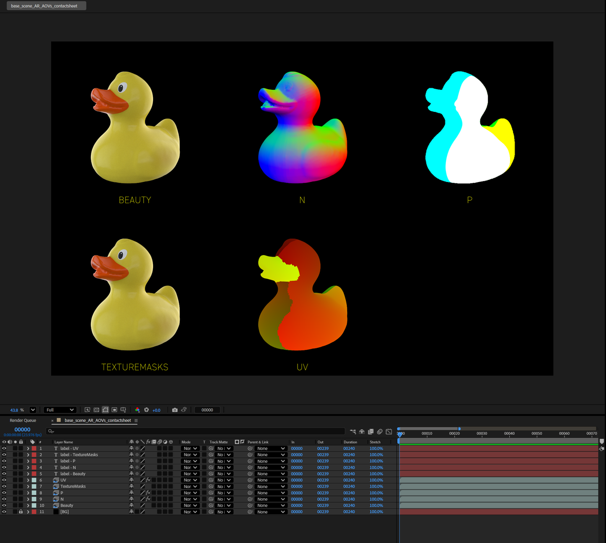
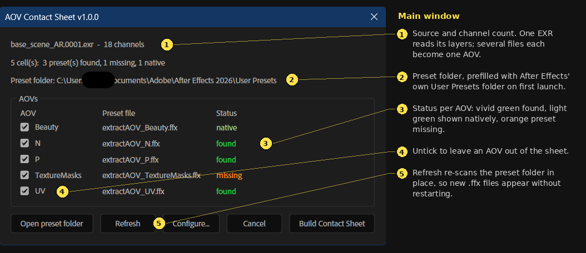
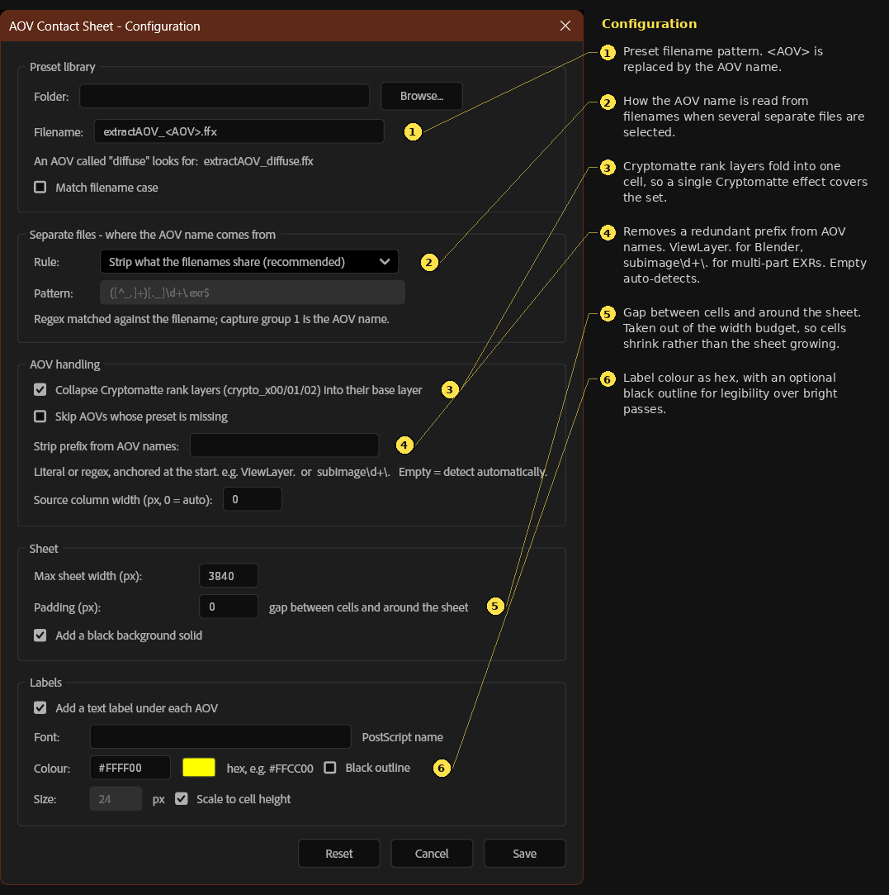

# jd_AOVcontactsheet

An After Effects script that builds a contact sheet comp from a render's AOVs, so
you can see every pass at once instead of soloing them one at a time.

Point it at a multi-layer EXR and it reads the channel list straight out of the
file header, works out which channels belong to which AOV, and lays them out in a
labelled grid. Point it at a folder's worth of single-AOV sequences and it does
the same thing across files.



---

## Requirements

- After Effects (tested on 2026)
- The **EXtractoR** effect, which ships with After Effects as part of ProEXR —
  only needed for the multi-layer EXR workflow
- A library of animation presets; 129 are included in `presets/`, see
  [Preset library](#preset-library) below

## Install

Copy `jd_AOVcontactsheet_v1_1_0.jsx` into your After Effects scripts folder:

```
Windows   C:\Program Files\Adobe\Adobe After Effects <version>\Support Files\Scripts\
macOS     /Applications/Adobe After Effects <version>/Scripts/
```

Then run it from **File → Scripts → jd_AOVcontactsheet_v1_1_0.jsx**.

Dropping it in `Scripts/ScriptUI Panels/` instead makes it available from the
**Window** menu.

## Quick start

1. Select your footage in the Project panel — either one multi-layer EXR, or
   several single-AOV sequences. With nothing selected the script opens a file
   picker instead, and that picker accepts multiple files.
2. Confirm the preset folder on first launch. It is prefilled with After Effects'
   own User Presets folder.
3. Check the list, untick anything you don't want, and hit **Build Contact Sheet**.

The result is a comp named `<source>_AOVs_contactsheet` containing one cell per
AOV, each labelled, sized to fit the grid, over a black background.

---

## Two modes

The script picks its mode from what you selected.

### Layers — one multi-layer EXR

The channel list is parsed directly from the OpenEXR header on disk rather than
asked of any plug-in, so detection is exact and works on multi-part files. The
channels are then grouped into AOVs:

| Channels in the file | Becomes |
| --- | --- |
| `R` `G` `B` `A` | `Beauty` — shown natively, placed first, no effect applied |
| `diffuse.R` `diffuse.G` `diffuse.B` | one `diffuse` cell |
| `N.X` `N.Y` `N.Z` | one `N` cell |
| `uv.u` `uv.v` | one `uv` cell |
| `Z` | one greyscale `Z` cell |
| `crypto_object` + `crypto_object00/01/02` | one `crypto_object` cell |
| `subimage03.DiffuseLighting.R/G/B` | one `DiffuseLighting` cell — the multi-part prefix is stripped |
| `subimage00.R/G/B/A` | `Beauty` — a part holding bare RGBA is the beauty pass |
| `ViewLayer.DiffDir.R/G/B` | one `DiffDir` cell — a layer prefix shared by every AOV is dropped |
| `CryptoObject00/01/02` (no base layer) | one `CryptoObject` cell |

Two kinds of redundant prefix are removed from cell names, each only when every
name stays unique afterwards. Multi-part EXRs carry a part name on every channel,
so an AOV would otherwise read as `subimage03.DiffuseLighting`. And some renderers
put a layer name in front of everything — Blender writes `ViewLayer.DiffDir.R` —
which is dropped when all AOVs share it. Comparison is by whole dot-separated
segment, never partial strings. The full channel base is recorded in each layer's
comment.

Auto-detection can only act on a prefix that every AOV shares, and it stays silent
when a file has one AOV or when stripping would make two names collide. For
anything it misses, set **Strip prefix from AOV names** in the configuration
window — a literal or a regex, anchored at the start of the name:

| Case | Value |
| --- | --- |
| Blender | `ViewLayer.` |
| Multi-part, prefix differs per AOV | `subimage\d+\.` |

An explicit value is applied to every AOV whether or not they all share it. The
only thing it will not do is leave a cell with no name at all. If stripping makes
two names identical, the sheet still builds and the report says which — they share
one label and one preset.

Note that the prefix still has to be correct *inside* a preset, since EXtractoR
resolves channels by exact name. Stripping only affects the cell label and the
preset filename it looks for, so it fixes matching, not a preset pointing at a
channel path that no longer exists.

Every non-beauty AOV needs a matching preset, because of
[the EXtractoR limitation described below](#why-animation-presets).

### Files — several files, or one non-EXR

Each selected sequence is treated as one AOV. Any footage After Effects can read
works here — EXR, PNG, TIFF, DPX, JPEG, even a QuickTime — and non-EXR sources
are laid out natively with no preset involved.

AOV names are read out of the filenames. The default rule removes the whole names
the filenames share:

```
shot_v03_diffuse.1001.exr   ->  diffuse
shot_v03_direct.1001.exr    ->  direct
shot_v03_Z.1001.exr         ->  Z
```

Comparison is by whole name token, never by character — a character-wise
comparison would decide the `di` in `diffuse`/`direct` was shared and mangle
both. Four other rules are available, including a custom regex; see
[Configuration](#configuration).

Every result is validated (names must be non-empty and unique) and falls through
to the next rule when validation fails, so a bad guess degrades instead of
producing nonsense. The main window states which rule ended up being used.

In this mode each row gets a **Preset** checkbox. It ticks itself when a matching
`.ffx` is found and can be forced on for any EXR row — which is how a separate
Cryptomatte sequence gets its Cryptomatte effect instead of showing raw hash
colours. Non-EXR rows can't take a preset and are locked off.

---

## Preset library

One `.ffx` per AOV in a single folder, named to a pattern you control. The
default is:

```
extractAOV_<AOV>.ffx
```

`<AOV>` is replaced by the AOV name, so the `diffuse` pass looks for
`extractAOV_diffuse.ffx`.

### Making one

1. Drop your multi-layer EXR into a comp.
2. Apply **EXtractoR** and set the Red / Green / Blue / Alpha dropdowns to the
   AOV you want.
3. Select **only the effect** in the timeline — not the whole layer — and choose
   **Animation → Save Animation Preset…**
4. Name it to match the pattern and save it into your preset folder.

If a preset captures transform properties it still works: presets are applied
before the grid layout is set, so the layout wins. But it will also drag along
anything else it captured, which is why selecting just the effect is worth doing.

### Cryptomatte

For Cryptomatte AOVs, save a **Cryptomatte** effect as the preset instead of
EXtractoR. The script doesn't care what's inside the `.ffx` — it just applies it
— so the crypto passes end up displaying properly rather than as raw ID hashes.

### Included library

129 presets ship in [`presets/`](presets/) — 123 EXtractoR and 6 Cryptomatte —
covering pass names from Arnold, Redshift, V-Ray, Houdini Mantra and Blender in one
flat set. [`presets/README.md`](presets/README.md) lists every one with the channels
it routes.

Point the script's **Preset folder** at `presets/`, or copy them into After Effects'
User Presets folder and leave the default path alone.

A few AOV names mean different things to different renderers — `Depth`, `AO` and
`UV` — and a flat folder can only hold one version of each. The preset README lists
which version is here and which renderer it breaks on. The failure is quiet: the cell
reports **found** and renders blank. A later version will detect it.

To copy presets you make later out of After Effects:

```powershell
Copy-Item "$env:USERPROFILE\Documents\Adobe\After Effects 2026\User Presets\extractAOV_*.ffx" -Destination ".\presets\"
```

---

## Main window



Status tells you what will happen to each cell:

| Status | Meaning |
| --- | --- |
| **found** (vivid green) | a matching preset exists and will be applied |
| **native** (light green) | shown as-is, no preset needed or wanted |
| **missing** (orange) | a preset is wanted but wasn't found |

`Open preset folder` reveals the folder in Explorer or Finder. `Refresh` re-scans
it in place, so a preset you just saved shows up without restarting the script.

## Configuration

Settings persist between runs via `app.settings`, so this is a once-per-machine
job. `Reset` restores every default.



| Setting | Default | Notes |
| --- | --- | --- |
| Preset folder | AE's User Presets | Prefilled on first launch |
| Preset filename | `extractAOV_<AOV>.ffx` | Must contain `<AOV>` |
| Match filename case | off | Off does a case-insensitive sweep of the folder |
| AOV name rule | Strip what the filenames share | Five rules; see below |
| Pattern | `([^_.]+)[._]\d+\.exr$` | Only used by the regex rule; capture group 1 is the name |
| Collapse Cryptomatte ranks | on | `crypto_object00/01/02` fold into `crypto_object` |
| Strip prefix from AOV names | empty (auto) | Literal or regex, anchored at the start. `ViewLayer.` for Blender, `subimage\d+\.` for multi-part |
| Skip AOVs whose preset is missing | off | Off still creates the cell, just unconfigured |
| Source column width | 0 (auto) | Sizes the column to the longest name |
| Max sheet width | 3840 px | The whole sheet is scaled to fit this |
| Padding | 0 px | Gap between cells and around the sheet |
| Black background solid | on | |
| Label | on, yellow, no outline, scaled to cell | Font list comes from `app.fonts` where available |

The five AOV name rules, in the order they're offered:

1. **Strip what the filenames share** — removes the leading names common to all
   files, then tries trailing
2. **Last name before the frame number** — `shot_v03_diffuse.1001.exr` → `diffuse`
3. **Custom pattern (regex)** — matched against the filename
4. **Whole filename**
5. **Parent folder name** — for pipelines that write identical filenames into
   per-AOV folders

---

## Why animation presets

Worth documenting, because it isn't obvious and it cost a lot of dead ends.

EXtractoR keeps its channel selection in a custom-UI parameter that reports
`PropertyValueType.NO_VALUE`. After Effects does not expose custom-value
properties to scripting at all — they can't be read or written. The dropdowns you
see in the effect are ProEXR's own drawn popups, not After Effects popup
parameters, so there's no menu index for a script to set either.

Approaches that do not work, all confirmed against a real file:

- Setting the `Layer Info` arbitrary data — `NO_VALUE`, rejected outright
- Setting `Red`/`Green`/`Blue`/`Alpha` by property name — those names don't
  resolve to the dropdowns
- Setting them by property index — the script-visible indices don't follow the UI
  order; a `NO_VALUE` property and a checkbox sit among them, so writes land on
  the wrong parameters and silently succeed while changing nothing
- Deriving a menu index from the channel or layer list — there is no popup to
  index into

An `.ffx` preset does carry that data, and `layer.applyPreset()` is scriptable.
Hence the preset library. It's a one-time setup cost in exchange for a workflow
that then runs unattended.

## Known limitations

- Non-beauty AOVs from a multi-layer EXR need a preset each. There is no way
  around this from ExtendScript.
- Every cell in layers mode is another instance of the same source file, so a
  30-AOV sheet off a 4K EXR is heavy to scrub.
- The AOV list is a single column, splitting into more only when it would run off
  the bottom of the screen. ScriptUI has no scrollable container for arbitrary
  controls.
- Cryptomatte passes shown through EXtractoR rather than a Cryptomatte effect
  will look like noise. That's correct — they're ID hashes, not imagery.

## Version

**1.1.0**
- Configurable padding between cells, taken out of the width budget so cells shrink
  rather than the sheet growing past its maximum width.
- Configurable AOV name prefix stripping, for Blender's `ViewLayer.` and for
  multi-part EXRs whose prefix differs per AOV.
- Cryptomatte rank layers collapse even when no un-suffixed base layer exists,
  which is how Blender writes them.
- Hardening: filenames decoded defensively, AOV names sanitised before being built
  into a preset path, bounds checks on the EXR header reader.

**1.0.0** — initial release.
