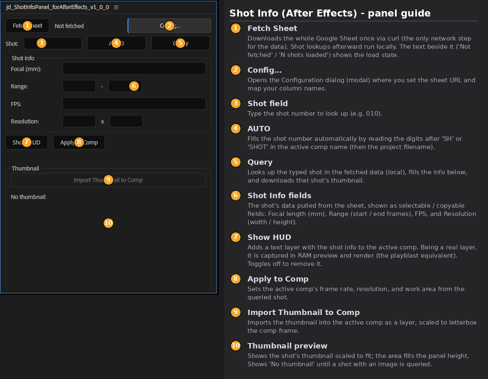
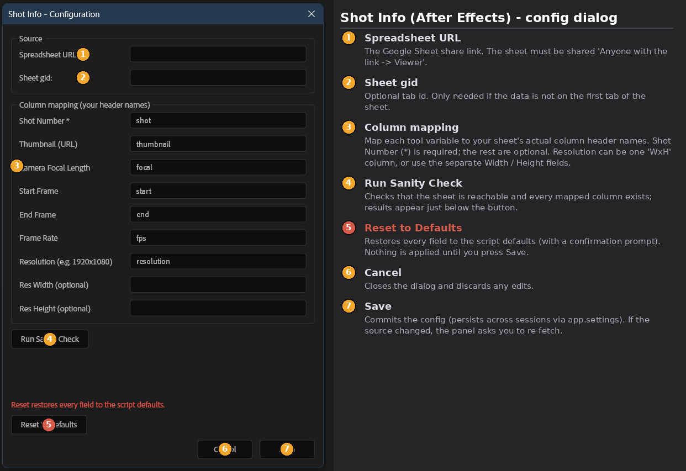

# jd_ShotInfoPanel_forAfterEffects

A dockable After Effects (ScriptUI) panel that pulls per-shot production data
from a **Google Sheet**: a thumbnail, the shot's camera / frame-range /
resolution info, an overlay HUD, and one-click import of the thumbnail into
the comp. The After Effects counterpart of the Blender / Maya "Shot Info" tool.

Current build: **`jd_ShotInfoPanel_forAfterEffects_v1_0_0.jsx`** (version 1.0.0).

> The `_forAfterEffects` tag and version suffix are per-DCC dev tracking; the
> panel itself shows as **"Shot Info"** in After Effects.



## Features

- **One-step fetch, local lookups.** *Fetch Sheet* downloads the sheet once;
  every shot lookup afterward is a local search.
- **Shot lookup + AUTO.** Type a shot number, or let *AUTO* read the digits
  after `SH` / `SHOT` in the active comp name (then the project filename).
- **Thumbnail.** Downloads only when a shot resolves, shown scaled-to-fit in a
  preview that tracks the panel height. Handles `=IMAGE("url")` cells (below).
- **Import to Comp.** Imports the thumbnail into the active comp as a layer,
  letterboxed to the comp frame.
- **Info fields.** Focal length, start/end frames, fps, and resolution, shown
  as selectable / copyable fields.
- **HUD.** Adds a text layer with the shot info to the active comp, so it is
  captured in RAM preview and render (the playblast equivalent).
- **Apply to Comp.** Sets the active comp's frame rate, resolution, and work
  area from the queried shot.
- **Configuration dialog.** URL, gid, and column mapping live in a modal
  dialog (Config...), with a sanity check and a reset. Config persists via
  `app.settings`.



## Requirements

- After Effects with ScriptUI (any recent version).
- **Preferences > Scripting & Expressions > "Allow Scripts to Write Files and
  Access Network"** must be enabled.
- `curl` (built into modern macOS and Windows 10/11) — used for HTTPS, which
  ExtendScript cannot do natively.
- The Google Sheet must be shared **"Anyone with the link -> Viewer."**

## Install

1. Copy `jd_ShotInfoPanel_forAfterEffects_v1_0_0.jsx` into After Effects'
   **ScriptUI Panels** folder:
   - Win: `<AE install>/Support Files/Scripts/ScriptUI Panels/`
   - Mac: `/Applications/Adobe After Effects <ver>/Scripts/ScriptUI Panels/`
2. Restart After Effects.
3. Open it from the **Window** menu (it docks like any panel).

## Quick start

1. Click **Config...**, paste your sheet **URL**, and enter your column
   header names. Click **Run Sanity Check**, then **Save**.
2. Back in the panel, click **Fetch Sheet**, type a shot (or **AUTO**), then
   **Query**.

## Data model

Each **row** is a shot, each **column** a field. The sheet is read through the
CSV export endpoint via curl:

```
https://docs.google.com/spreadsheets/d/<ID>/export?format=csv&gid=<GID>
```

### `=IMAGE()` thumbnails

Google's CSV export returns `=IMAGE("url")` formula cells as **empty**. When
the thumbnail column comes through blank, the panel recovers the URLs from the
XLSX export by reading the worksheet XML with `tar` (best-effort; if `tar`
isn't available the rest still works). Plain URL columns are used as-is.

## Platform notes (how AE differs from Blender / Maya)

- **Networking is done with `curl`** via `system.callSystem()`, because
  ExtendScript has no native HTTPS.
- **Thumbnails are named by their real format** (magic-byte sniff) before
  import, so AE's importer doesn't reject a mislabelled file.
- **No per-project state:** AE has no clean per-project store, so config is
  app-wide (`app.settings`) and there is no per-project shot memory — use AUTO.
- **Reset can't be a red button** (ScriptUI limitation); it's a red warning
  line above the button, with a confirmation prompt.

## License

MIT — see the repository's root [LICENSE](../LICENSE).
